# System Architecture Overview

This diagram shows the overall system architecture of the Jira MCP Connector, including all major components and their relationships.

```mermaid
graph TB
    subgraph "External Systems"
        AI["AI Assistant<br/>(Claude, etc.)"]
        JIRA["Atlassian Jira<br/>API"]
        AGILE["Atlassian Agile<br/>API"]
    end
    
    subgraph "Jira MCP Connector"
        subgraph "Entry Point"
            MAIN["main.go<br/>MCP Server Setup"]
        end
        
        subgraph "MCP Layer"
            SERVER["MCP Server<br/>Tool Registration"]
            STDIO["STDIO Transport"]
            SSE["SSE Transport<br/>(Optional)"]
        end
        
        subgraph "Tools Layer"
            ISSUE["Issue Tools<br/>jira_issue.go"]
            SEARCH["Search Tools<br/>jira_search.go"]
            SPRINT["Sprint Tools<br/>jira_sprint.go"]
            STATUS["Status Tools<br/>jira_status.go"]
            TRANS["Transition Tools<br/>jira_transition.go"]
            WORK["Worklog Tools<br/>jira_worklog.go"]
            COMMENT["Comment Tools<br/>jira_comment.go"]
            HIST["History Tools<br/>jira_history.go"]
            REL["Relationship Tools<br/>jira_relationship.go"]
        end
        
        subgraph "Service Layer"
            JCLIENT["Jira Client<br/>services/jira.go"]
            ACLIENT["Agile Client<br/>services/atlassian.go"]
            HTTP["HTTP Client<br/>services/httpclient.go"]
        end
        
        subgraph "Utilities"
            ERROR["Error Guard<br/>util/handler.go"]
            FORMAT["Jira Formatter<br/>util/jira_formatter.go"]
        end
        
        subgraph "Configuration"
            ENV["Environment Variables<br/>ATLASSIAN_HOST<br/>ATLASSIAN_EMAIL<br/>ATLASSIAN_TOKEN"]
        end
    end
    
    %% External connections
    AI -.->|MCP Protocol| SERVER
    JCLIENT -->|REST API| JIRA
    ACLIENT -->|REST API| AGILE
    
    %% Internal connections
    MAIN --> SERVER
    SERVER --> STDIO
    SERVER --> SSE
    
    %% Tool registrations
    MAIN --> ISSUE
    MAIN --> SEARCH
    MAIN --> SPRINT
    MAIN --> STATUS
    MAIN --> TRANS
    MAIN --> WORK
    MAIN --> COMMENT
    MAIN --> HIST
    MAIN --> REL
    
    %% Service usage
    ISSUE --> JCLIENT
    SEARCH --> JCLIENT
    SPRINT --> ACLIENT
    STATUS --> JCLIENT
    TRANS --> JCLIENT
    WORK --> JCLIENT
    COMMENT --> JCLIENT
    HIST --> JCLIENT
    REL --> JCLIENT
    
    %% Utility usage
    ISSUE --> ERROR
    SEARCH --> ERROR
    SPRINT --> ERROR
    STATUS --> ERROR
    TRANS --> ERROR
    WORK --> ERROR
    COMMENT --> ERROR
    HIST --> ERROR
    REL --> ERROR
    
    ISSUE --> FORMAT
    SEARCH --> FORMAT
    SPRINT --> FORMAT
    
    %% Configuration
    ENV --> JCLIENT
    ENV --> ACLIENT
    
    classDef external fill:#e1f5fe
    classDef entry fill:#f3e5f5
    classDef mcp fill:#e8f5e8
    classDef tools fill:#fff3e0
    classDef services fill:#fce4ec
    classDef utils fill:#f1f8e9
    classDef config fill:#fff8e1
    
    class AI,JIRA,AGILE external
    class MAIN entry
    class SERVER,STDIO,SSE mcp
    class ISSUE,SEARCH,SPRINT,STATUS,TRANS,WORK,COMMENT,HIST,REL tools
    class JCLIENT,ACLIENT,HTTP services
    class ERROR,FORMAT utils
    class ENV config
```

## Key Components

### External Systems
- **AI Assistant**: Claude or other AI assistants that communicate via MCP protocol
- **Atlassian APIs**: Jira REST API v2/v3 and Agile API v1

### Entry Point
- **main.go**: Initializes the MCP server and registers all tool categories

### MCP Layer
- **MCP Server**: Handles tool registration and request routing
- **Transport**: Supports both STDIO (default) and SSE modes

### Tools Layer
- **9 Tool Categories**: Each implementing specific Jira operations
- All tools follow the same implementation pattern

### Service Layer
- **Singleton Clients**: Thread-safe, initialized once using `sync.OnceValue`
- **Authentication**: Basic auth with API tokens

### Utilities
- **Error Guard**: Panic recovery and error formatting
- **Jira Formatter**: Consistent response formatting 