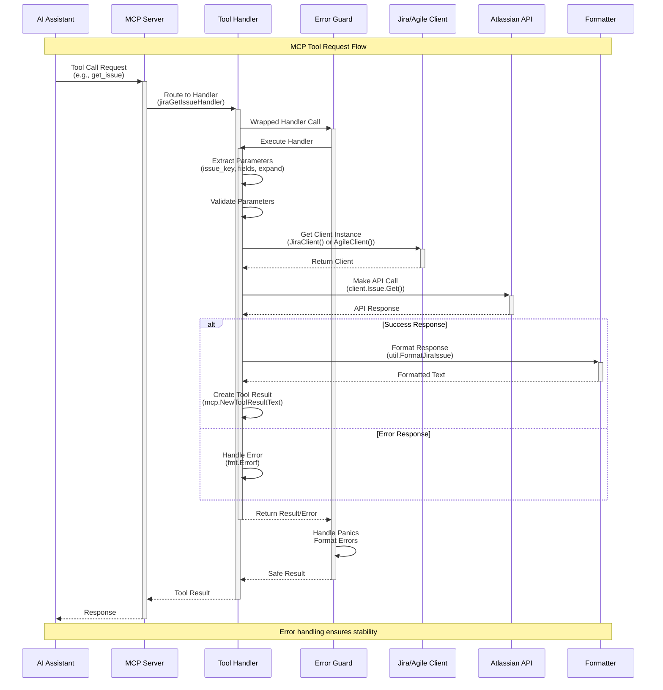

# MCP Tool Request Flow

This sequence diagram shows how requests flow through the system from AI Assistant to Atlassian API and back.

## Flow Description

### 1. Request Initiation
- AI Assistant sends a tool call request via MCP protocol
- MCP Server routes the request to the appropriate tool handler

### 2. Error Protection
- All handlers are wrapped with `util.ErrorGuard` for panic recovery
- Ensures system stability even with unexpected errors

### 3. Parameter Processing
- Extract parameters from `request.Params.Arguments`
- Validate required parameters
- Parse optional parameters with defaults

### 4. Service Layer
- Get singleton client instance (thread-safe)
- Clients are initialized once and reused

### 5. API Communication
- Make REST API calls to Atlassian services
- Handle both success and error responses

### 6. Response Processing
- Format successful responses using utility functions
- Create standardized MCP tool results
- Handle errors with detailed information

### 7. Error Handling
- Multiple layers of error handling
- Panic recovery at the guard level
- Detailed error messages with endpoint information 