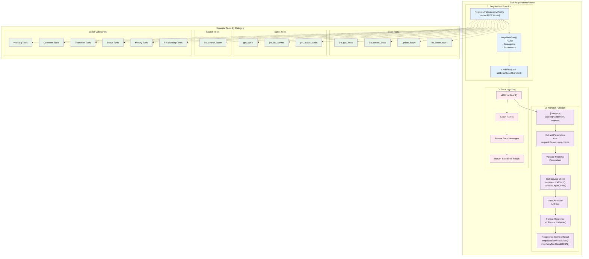

# Tool Implementation Pattern

This diagram shows the consistent pattern used across all MCP tools in the project.



## Implementation Pattern Details

### 1. Registration Function
Each tool category has a registration function that:
- Creates tool definitions using `mcp.NewTool()`
- Defines parameters (required and optional)
- Registers tools with error guard wrapper

**Example:**
```go
func RegisterJiraIssueTool(s *server.MCPServer) {
    jiraGetIssueTool := mcp.NewTool("jira_get_issue",
        mcp.WithDescription("Retrieve detailed information..."),
        mcp.WithString("issue_key", mcp.Required(), mcp.Description("...")),
    )
    s.AddTool(jiraGetIssueTool, util.ErrorGuard(jiraGetIssueHandler))
}
```

### 2. Handler Function
Each tool has a handler function that follows this pattern:
1. **Extract Parameters**: Get arguments from the request
2. **Validate Parameters**: Check required parameters
3. **Get Service Client**: Retrieve singleton client instance
4. **Make API Call**: Call Atlassian API
5. **Format Response**: Use utility functions for consistent formatting
6. **Return Result**: Create MCP tool result

**Example:**
```go
func jiraGetIssueHandler(ctx context.Context, request mcp.CallToolRequest) (*mcp.CallToolResult, error) {
    client := services.JiraClient()
    issueKey := request.Params.Arguments["issue_key"].(string)
    
    issue, response, err := client.Issue.Get(ctx, issueKey, nil, []string{"transitions"})
    if err != nil {
        return nil, fmt.Errorf("failed to get issue: %v", err)
    }
    
    result := util.FormatJiraIssue(issue)
    return mcp.NewToolResultText(result), nil
}
```

### 3. Error Handling
All handlers are wrapped with `util.ErrorGuard()` which:
- Catches and recovers from panics
- Formats error messages consistently
- Returns errors as tool results instead of crashing

## Tool Categories

### Core Operations
- **Issue Tools**: CRUD operations for Jira issues
- **Search Tools**: JQL-based issue searching
- **Sprint Tools**: Agile sprint management

### Workflow Operations
- **Status Tools**: Issue status management
- **Transition Tools**: Issue workflow transitions
- **Worklog Tools**: Time tracking

### Collaboration
- **Comment Tools**: Issue comments
- **History Tools**: Change tracking
- **Relationship Tools**: Issue linking 