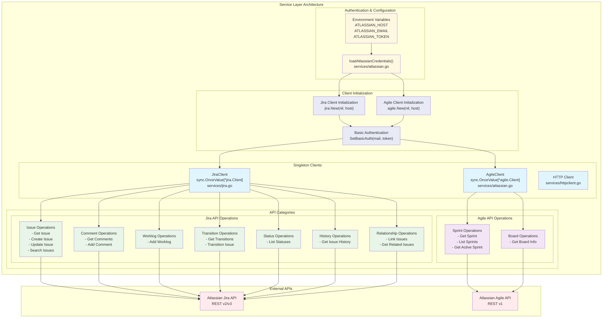

# Service Layer Architecture

This diagram shows the service layer architecture, including client initialization, authentication, and API operations.



## Service Layer Components

### Authentication & Configuration
- **Environment Variables**: Required credentials loaded from environment
- **loadAtlassianCredentials()**: Centralized credential loading function
- **Validation**: Ensures all required credentials are present

### Client Initialization
- **Thread-Safe Initialization**: Uses `sync.OnceValue` for singleton pattern
- **Basic Authentication**: Configured with email and API token
- **Error Handling**: Fails fast if initialization fails

### Singleton Clients
Both clients are implemented as singletons to ensure:
- **Resource Efficiency**: Single connection pool per client
- **Thread Safety**: Safe for concurrent use
- **Configuration Consistency**: Same configuration across all requests

**Jira Client Example:**
```go
var JiraClient = sync.OnceValue[*jira.Client](func() *jira.Client {
    host, mail, token := loadAtlassianCredentials()
    instance, err := jira.New(nil, host)
    if err != nil {
        log.Fatal(errors.WithMessage(err, "failed to create jira client"))
    }
    instance.Auth.SetBasicAuth(mail, token)
    return instance
})
```

### API Operations

#### Jira API Operations
- **Issue Operations**: Core CRUD operations for Jira issues
- **Comment Operations**: Issue comment management
- **Worklog Operations**: Time tracking functionality
- **Transition Operations**: Workflow state changes
- **Status Operations**: Status information retrieval
- **History Operations**: Change history tracking
- **Relationship Operations**: Issue linking and relationships

#### Agile API Operations
- **Sprint Operations**: Sprint lifecycle management
- **Board Operations**: Agile board information

### External API Integration
- **Jira REST API**: v2/v3 endpoints for core functionality
- **Agile REST API**: v1 endpoints for agile-specific features
- **Authentication**: Basic auth with API tokens
- **Error Handling**: Comprehensive error responses with endpoint information

## Key Features

### Singleton Pattern Benefits
1. **Performance**: Avoids repeated client initialization
2. **Resource Management**: Single connection pool per service
3. **Thread Safety**: Safe for concurrent access
4. **Configuration Consistency**: Same settings across all requests

### Error Handling
- **Initialization Errors**: Fail fast with clear error messages
- **Runtime Errors**: Detailed error information including API endpoints
- **Authentication Errors**: Clear indication of credential issues

### Extensibility
- **New API Categories**: Easy to add new operation groups
- **Additional Clients**: Pattern supports additional service clients
- **Custom Configuration**: Flexible credential and configuration management 