# Request Processing Flow

This flowchart shows the detailed flow of how requests are processed through the system, including all error handling paths.

```mermaid
flowchart TD
    subgraph "Request Processing Flow"
        START([AI Assistant Request])
        
        subgraph "MCP Server Layer"
            RECEIVE["Receive MCP Tool Call<br/>via STDIO/SSE"]
            ROUTE["Route to Registered<br/>Tool Handler"]
        end
        
        subgraph "Error Guard Layer"
            GUARD_START["util.ErrorGuard<br/>Wrapper Entry"]
            PANIC_CATCH["Panic Recovery<br/>Mechanism"]
        end
        
        subgraph "Tool Handler Layer"
            EXTRACT["Extract Parameters<br/>from Arguments"]
            VALIDATE["Validate Required<br/>Parameters"]
            
            subgraph "Parameter Processing"
                PARSE_FIELDS["Parse 'fields' parameter<br/>(comma-separated)"]
                PARSE_EXPAND["Parse 'expand' parameter<br/>(with defaults)"]
                PARSE_OTHER["Parse other parameters<br/>(issue_key, project_key, etc.)"]
            end
        end
        
        subgraph "Service Layer"
            GET_CLIENT["Get Singleton Client<br/>JiraClient() or AgileClient()"]
            CHECK_AUTH["Verify Authentication<br/>(Basic Auth with token)"]
        end
        
        subgraph "API Layer"
            API_CALL["Make Atlassian API Call<br/>(GET/POST/PUT)"]
            API_RESPONSE["Receive API Response<br/>(JSON data)"]
            API_ERROR{"API Error?"}
        end
        
        subgraph "Response Processing"
            FORMAT_SUCCESS["Format Success Response<br/>util.FormatJiraIssue()"]
            FORMAT_ERROR["Format Error Message<br/>with endpoint info"]
            CREATE_RESULT["Create MCP Tool Result<br/>mcp.NewToolResultText()"]
        end
        
        subgraph "Error Handling"
            HANDLE_PANIC["Handle Panic<br/>Return Safe Error"]
            HANDLE_API_ERROR["Handle API Error<br/>Include Response Details"]
            HANDLE_PARAM_ERROR["Handle Parameter Error<br/>Clear Error Message"]
        end
        
        FINISH([Return to AI Assistant])
    end
    
    %% Main flow
    START --> RECEIVE
    RECEIVE --> ROUTE
    ROUTE --> GUARD_START
    GUARD_START --> EXTRACT
    
    EXTRACT --> VALIDATE
    VALIDATE --> PARSE_FIELDS
    PARSE_FIELDS --> PARSE_EXPAND
    PARSE_EXPAND --> PARSE_OTHER
    PARSE_OTHER --> GET_CLIENT
    
    GET_CLIENT --> CHECK_AUTH
    CHECK_AUTH --> API_CALL
    API_CALL --> API_RESPONSE
    API_RESPONSE --> API_ERROR
    
    %% Success path
    API_ERROR -->|No| FORMAT_SUCCESS
    FORMAT_SUCCESS --> CREATE_RESULT
    CREATE_RESULT --> FINISH
    
    %% Error paths
    API_ERROR -->|Yes| HANDLE_API_ERROR
    HANDLE_API_ERROR --> FORMAT_ERROR
    FORMAT_ERROR --> CREATE_RESULT
    
    VALIDATE -->|Invalid| HANDLE_PARAM_ERROR
    HANDLE_PARAM_ERROR --> CREATE_RESULT
    
    GUARD_START --> PANIC_CATCH
    PANIC_CATCH --> HANDLE_PANIC
    HANDLE_PANIC --> CREATE_RESULT
    
    classDef startEnd fill:#c8e6c9
    classDef mcp fill:#e1f5fe
    classDef guard fill:#fff3e0
    classDef handler fill:#f3e5f5
    classDef service fill:#e8eaf6
    classDef api fill:#ffebee
    classDef response fill:#e8f5e8
    classDef error fill:#ffcdd2
    
    class START,FINISH startEnd
    class RECEIVE,ROUTE mcp
    class GUARD_START,PANIC_CATCH guard
    class EXTRACT,VALIDATE,PARSE_FIELDS,PARSE_EXPAND,PARSE_OTHER handler
    class GET_CLIENT,CHECK_AUTH service
    class API_CALL,API_RESPONSE,API_ERROR api
    class FORMAT_SUCCESS,CREATE_RESULT response
    class HANDLE_PANIC,HANDLE_API_ERROR,HANDLE_PARAM_ERROR,FORMAT_ERROR error
```

## Flow Description

### 1. Request Initiation
- **AI Assistant Request**: Initiated by Claude or other AI assistants
- **MCP Protocol**: Uses Model Control Protocol for structured communication
- **Transport**: Supports both STDIO (default) and SSE modes

### 2. MCP Server Layer
- **Request Reception**: Receives tool call via configured transport
- **Tool Routing**: Routes request to appropriate registered tool handler
- **Tool Registry**: Maintains mapping of tool names to handlers

### 3. Error Guard Layer
- **Wrapper Entry**: All handlers wrapped with `util.ErrorGuard`
- **Panic Recovery**: Catches and recovers from unexpected panics
- **Safe Execution**: Ensures system stability even with handler failures

### 4. Tool Handler Layer
- **Parameter Extraction**: Gets arguments from `request.Params.Arguments`
- **Parameter Validation**: Checks for required parameters
- **Parameter Processing**: Parses and formats parameters appropriately

#### Parameter Processing Details
- **Fields Parameter**: Comma-separated list of fields to retrieve
- **Expand Parameter**: Fields to expand with default values
- **Other Parameters**: Issue keys, project keys, etc.

### 5. Service Layer
- **Client Retrieval**: Gets singleton client instance (thread-safe)
- **Authentication Check**: Verifies credentials are properly configured
- **Connection Management**: Reuses established connections

### 6. API Layer
- **API Call Execution**: Makes REST calls to Atlassian services
- **Response Handling**: Processes JSON responses from APIs
- **Error Detection**: Identifies API-level errors and failures

### 7. Response Processing
- **Success Formatting**: Uses utility functions for consistent formatting
- **Error Formatting**: Includes endpoint information in error messages
- **Result Creation**: Creates standardized MCP tool results

### 8. Error Handling Paths

#### Parameter Validation Errors
- **Detection**: Invalid or missing required parameters
- **Handling**: Clear error messages indicating what's missing
- **Response**: Formatted error result returned to AI

#### API Errors
- **Detection**: HTTP errors, authentication failures, etc.
- **Handling**: Detailed error information including endpoint
- **Response**: Comprehensive error details for debugging

#### Panic Recovery
- **Detection**: Unexpected runtime panics in handlers
- **Handling**: Graceful recovery with error logging
- **Response**: Safe error result preventing system crash

## Key Features

### Robustness
- **Multiple Error Handling Layers**: Ensures system stability
- **Panic Recovery**: Prevents crashes from unexpected errors
- **Detailed Error Information**: Helps with debugging and troubleshooting

### Performance
- **Singleton Clients**: Efficient resource usage
- **Connection Reuse**: Minimizes connection overhead
- **Concurrent Safety**: Thread-safe operations

### Maintainability
- **Consistent Pattern**: Same flow for all tools
- **Centralized Error Handling**: Common error processing logic
- **Clear Separation of Concerns**: Each layer has specific responsibilities

### Extensibility
- **Easy Tool Addition**: New tools follow the same pattern
- **Flexible Parameter Processing**: Supports various parameter types
- **Configurable Formatting**: Customizable response formatting 