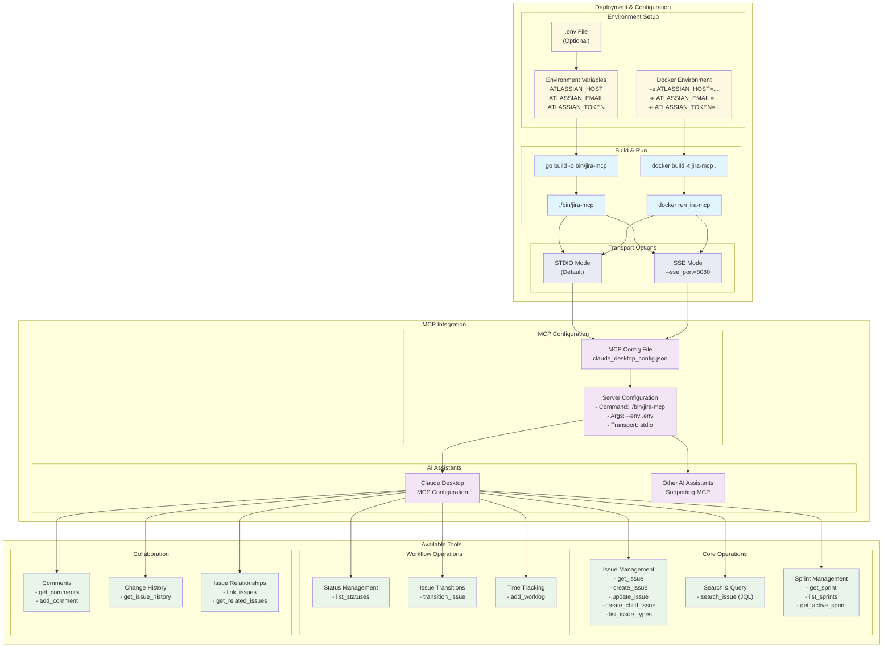

# Deployment & Configuration

This diagram shows the deployment options, configuration requirements, and available tools for the Jira MCP Connector.



## Deployment Options

### Environment Setup

#### Required Environment Variables
```bash
ATLASSIAN_HOST=https://your-domain.atlassian.net
ATLASSIAN_EMAIL=your-email@example.com
ATLASSIAN_TOKEN=your-api-token
```

#### Configuration Methods
1. **Environment File**: Use `.env` file with `--env .env` flag
2. **Direct Environment Variables**: Set variables directly in shell
3. **Docker Environment**: Pass variables with `-e` flags

### Build & Run Options

#### Native Binary
```bash
# Build
go build -o bin/jira-mcp

# Run with environment file
./bin/jira-mcp --env .env

# Run with SSE mode
./bin/jira-mcp --env .env --sse_port 8080
```

#### Docker
```bash
# Build
docker build -t jira-mcp .

# Run with environment variables
docker run -e ATLASSIAN_HOST=... -e ATLASSIAN_EMAIL=... -e ATLASSIAN_TOKEN=... jira-mcp

# Run with environment file
docker run -v $(pwd)/.env:/app/.env jira-mcp --env /app/.env
```

### Transport Modes

#### STDIO Mode (Default)
- **Use Case**: Integration with AI assistants like Claude Desktop
- **Communication**: Standard input/output streams
- **Configuration**: Default mode, no additional flags needed

#### SSE Mode (Optional)
- **Use Case**: Web-based integrations or debugging
- **Communication**: Server-Sent Events over HTTP
- **Configuration**: Use `--sse_port` flag to specify port

## MCP Integration

### Claude Desktop Configuration
Add to `claude_desktop_config.json`:
```json
{
  "mcpServers": {
    "jira": {
      "command": "./bin/jira-mcp",
      "args": ["--env", ".env"],
      "env": {}
    }
  }
}
```

### Other AI Assistants
The connector supports any AI assistant that implements the MCP protocol:
- **Standard MCP Protocol**: Follows MCP specification
- **Tool Discovery**: Automatic tool registration and discovery
- **Error Handling**: Robust error responses

## Available Tools

### Core Operations (9 tools)
- **Issue Management**: Complete CRUD operations for Jira issues
- **Search & Query**: JQL-based issue searching
- **Sprint Management**: Agile sprint operations

### Workflow Operations (3 tools)
- **Status Management**: Issue status information
- **Issue Transitions**: Workflow state changes
- **Time Tracking**: Worklog management

### Collaboration (6 tools)
- **Comments**: Issue comment management
- **Change History**: Issue change tracking
- **Issue Relationships**: Linking and relationship management

## Configuration Best Practices

### Security
- **API Tokens**: Use API tokens instead of passwords
- **Environment Variables**: Keep credentials in environment variables
- **File Permissions**: Secure `.env` files with appropriate permissions

### Performance
- **Connection Reuse**: Singleton clients for efficient resource usage
- **Error Handling**: Comprehensive error handling prevents crashes
- **Concurrent Safety**: Thread-safe operations for multiple requests

### Monitoring
- **Logging**: Built-in logging for debugging and monitoring
- **Error Reporting**: Detailed error messages with endpoint information
- **Health Checks**: Client initialization validates connectivity

## Troubleshooting

### Common Issues
1. **Authentication Errors**: Verify API token and email
2. **Connection Issues**: Check ATLASSIAN_HOST URL
3. **Permission Errors**: Ensure API token has required permissions

### Debug Mode
- **SSE Mode**: Use for debugging and testing
- **Logging**: Enable verbose logging for troubleshooting
- **Error Details**: Check error messages for endpoint information 