# System Diagrams - Jira MCP Connector

This document contains comprehensive visual representations of the Jira MCP Connector system architecture, flows, and components.

## 1. High-Level System Architecture

```mermaid
graph TB
    subgraph "External Environment"
        USER["👤 User<br/>(Developer/PM)"]
        AI["🤖 AI Assistant<br/>(Claude, GPT, etc.)"]
        JIRA_CLOUD["☁️ Atlassian Cloud<br/>Jira + Agile APIs"]
    end
    
    subgraph "Jira MCP Connector"
        subgraph "Application Layer"
            MAIN["🚀 main.go<br/>Entry Point"]
            CONFIG["⚙️ Configuration<br/>Environment Setup"]
        end
        
        subgraph "MCP Protocol Layer"
            SERVER["📡 MCP Server<br/>Tool Registry"]
            STDIO["📥 STDIO Transport"]
            HTTP["🌐 HTTP Transport<br/>(Optional)"]
        end
        
        subgraph "Business Logic Layer"
            TOOLS["🔧 Tool Handlers<br/>9 Categories"]
            GUARD["🛡️ Error Guard<br/>Panic Recovery"]
            FORMAT["📋 Response Formatter<br/>Text & JSON"]
        end
        
        subgraph "Service Layer"
            JIRA_CLIENT["📊 Jira Client<br/>Core Operations"]
            AGILE_CLIENT["🏃 Agile Client<br/>Sprint Management"]
            HTTP_CLIENT["🌐 HTTP Client<br/>Custom Config"]
        end
    end
    
    %% User interactions
    USER -->|"Asks questions"| AI
    AI <-->|"MCP Protocol"| SERVER
    
    %% Internal flow
    MAIN --> SERVER
    MAIN --> CONFIG
    SERVER --> STDIO
    SERVER --> HTTP
    SERVER --> TOOLS
    TOOLS --> GUARD
    TOOLS --> FORMAT
    TOOLS --> JIRA_CLIENT
    TOOLS --> AGILE_CLIENT
    JIRA_CLIENT --> HTTP_CLIENT
    AGILE_CLIENT --> HTTP_CLIENT
    
    %% External API calls
    JIRA_CLIENT <-->|"REST API v2/v3"| JIRA_CLOUD
    AGILE_CLIENT <-->|"Agile API v1"| JIRA_CLOUD
    
    %% Configuration
    CONFIG -.->|"Env Variables"| JIRA_CLIENT
    CONFIG -.->|"Env Variables"| AGILE_CLIENT
    
    classDef external fill:#e3f2fd,stroke:#1976d2,stroke-width:2px
    classDef app fill:#f3e5f5,stroke:#7b1fa2,stroke-width:2px
    classDef mcp fill:#e8f5e8,stroke:#388e3c,stroke-width:2px
    classDef business fill:#fff3e0,stroke:#f57c00,stroke-width:2px
    classDef service fill:#fce4ec,stroke:#c2185b,stroke-width:2px
    
    class USER,AI,JIRA_CLOUD external
    class MAIN,CONFIG app
    class SERVER,STDIO,HTTP mcp
    class TOOLS,GUARD,FORMAT business
    class JIRA_CLIENT,AGILE_CLIENT,HTTP_CLIENT service
```

## 2. Detailed Component Architecture

```mermaid
graph TB
    subgraph "Tool Categories"
        ISSUE["📋 Issue Management<br/>• get_issue<br/>• create_issue<br/>• update_issue<br/>• delete_issue<br/>• assign_issue"]
        SEARCH["🔍 Search & Query<br/>• search_issues<br/>• jql_search<br/>• filter_issues"]
        SPRINT["🏃 Sprint Operations<br/>• get_sprint<br/>• create_sprint<br/>• start_sprint<br/>• complete_sprint<br/>• move_to_sprint"]
        STATUS["📊 Status Management<br/>• get_statuses<br/>• get_status_transitions"]
        TRANS["🔄 Transitions<br/>• transition_issue<br/>• get_transitions"]
        WORK["⏱️ Worklog<br/>• add_worklog<br/>• get_worklog<br/>• update_worklog<br/>• delete_worklog"]
        COMMENT["💬 Comments<br/>• add_comment<br/>• get_comments<br/>• update_comment<br/>• delete_comment"]
        HIST["📚 History<br/>• get_issue_history<br/>• get_changelog"]
        REL["🔗 Relationships<br/>• link_issues<br/>• get_issue_links<br/>• remove_link"]
    end
    
    subgraph "Service Clients"
        JIRA_SVC["🔧 Jira Client<br/>services/jira.go<br/>• Issue operations<br/>• Project management<br/>• User management"]
        AGILE_SVC["📈 Agile Client<br/>services/atlassian.go<br/>• Board operations<br/>• Sprint management<br/>• Backlog management"]
        HTTP_SVC["🌐 HTTP Client<br/>services/httpclient.go<br/>• Custom configuration<br/>• Authentication handling"]
    end
    
    subgraph "Utilities"
        ERROR_UTIL["🛡️ Error Handler<br/>util/handler.go<br/>• Panic recovery<br/>• Error formatting<br/>• Safe execution"]
        FORMAT_UTIL["📝 Formatter<br/>util/jira_formatter.go<br/>• Issue formatting<br/>• Sprint formatting<br/>• JSON/Text output"]
    end
    
    %% Tool to service mappings
    ISSUE --> JIRA_SVC
    SEARCH --> JIRA_SVC
    STATUS --> JIRA_SVC
    TRANS --> JIRA_SVC
    WORK --> JIRA_SVC
    COMMENT --> JIRA_SVC
    HIST --> JIRA_SVC
    REL --> JIRA_SVC
    SPRINT --> AGILE_SVC
    
    %% Service dependencies
    JIRA_SVC --> HTTP_SVC
    AGILE_SVC --> HTTP_SVC
    
    %% Utility usage
    ISSUE --> ERROR_UTIL
    SEARCH --> ERROR_UTIL
    SPRINT --> ERROR_UTIL
    STATUS --> ERROR_UTIL
    TRANS --> ERROR_UTIL
    WORK --> ERROR_UTIL
    COMMENT --> ERROR_UTIL
    HIST --> ERROR_UTIL
    REL --> ERROR_UTIL
    
    ISSUE --> FORMAT_UTIL
    SEARCH --> FORMAT_UTIL
    SPRINT --> FORMAT_UTIL
    
    classDef tools fill:#e1f5fe,stroke:#0277bd,stroke-width:2px
    classDef services fill:#f3e5f5,stroke:#7b1fa2,stroke-width:2px
    classDef utils fill:#e8f5e8,stroke:#388e3c,stroke-width:2px
    
    class ISSUE,SEARCH,SPRINT,STATUS,TRANS,WORK,COMMENT,HIST,REL tools
    class JIRA_SVC,AGILE_SVC,HTTP_SVC services
    class ERROR_UTIL,FORMAT_UTIL utils
```

## 3. Tool Implementation Pattern

```mermaid
graph TB
    subgraph "Tool Registration Process"
        A["🚀 main.go<br/>Server Initialization"]
        B["📋 RegisterJira<Category>Tool()<br/>Tool Definition"]
        C["🔧 mcp.NewTool()<br/>Tool Creation"]
        D["📝 Tool Parameters<br/>Required & Optional"]
        E["🗂️ AddTool()<br/>Server Registration"]
    end
    
    subgraph "Request Handling Flow"
        F["📥 Incoming Request<br/>MCP Protocol"]
        G["🛡️ util.ErrorGuard<br/>Wrapper Function"]
        H["⚙️ Tool Handler Function<br/>Business Logic"]
        I["🔍 Parameter Extraction<br/>& Validation"]
        J["🌐 Service Client Call<br/>API Request"]
        K["📊 Response Processing<br/>& Formatting"]
        L["📤 MCP Tool Result<br/>Text or JSON"]
    end
    
    subgraph "Error Handling"
        M["❌ API Error"]
        N["🚨 Panic Recovery"]
        O["📝 Error Formatting"]
        P["🔄 Safe Return"]
    end
    
    A --> B
    B --> C
    C --> D
    D --> E
    
    F --> G
    G --> H
    H --> I
    I --> J
    J --> K
    K --> L
    
    J --> M
    H --> N
    M --> O
    N --> O
    O --> P
    P --> L
    
    classDef registration fill:#e8f5e8,stroke:#388e3c,stroke-width:2px
    classDef handling fill:#e1f5fe,stroke:#0277bd,stroke-width:2px
    classDef error fill:#ffebee,stroke:#d32f2f,stroke-width:2px
    
    class A,B,C,D,E registration
    class F,G,H,I,J,K,L handling
    class M,N,O,P error
```

## 4. Authentication & Configuration Flow

```mermaid
sequenceDiagram
    participant USER as 👤 User
    participant ENV as ⚙️ Environment
    participant MAIN as 🚀 main.go
    participant SERVICE as 🔧 Service Client
    participant API as ☁️ Atlassian API
    
    Note over USER,API: Configuration & Authentication Setup
    
    USER->>ENV: Set Environment Variables<br/>ATLASSIAN_HOST<br/>ATLASSIAN_EMAIL<br/>ATLASSIAN_TOKEN
    
    MAIN->>ENV: Load .env file (optional)
    MAIN->>ENV: Validate required variables
    
    alt Missing Variables
        ENV-->>MAIN: Missing variables
        MAIN->>USER: ❌ Configuration Error<br/>Setup Instructions
    else All Variables Present
        ENV-->>MAIN: ✅ All variables set
        MAIN->>MAIN: Display connection info
    end
    
    Note over MAIN,API: Service Client Initialization
    
    MAIN->>SERVICE: First tool call triggers<br/>JiraClient() or AgileClient()
    SERVICE->>ENV: loadAtlassianCredentials()
    ENV-->>SERVICE: host, email, token
    SERVICE->>SERVICE: Create client instance<br/>with basic auth
    SERVICE->>API: Test connection<br/>(implicit with first request)
    
    alt Authentication Success
        API-->>SERVICE: ✅ Valid response
        SERVICE-->>MAIN: Client ready
    else Authentication Failure
        API-->>SERVICE: ❌ 401/403 Error
        SERVICE-->>MAIN: Authentication error
    end
    
    Note over USER,API: Ongoing Operations
    
    loop For each tool request
        MAIN->>SERVICE: Get cached client
        SERVICE->>API: Authenticated request
        API-->>SERVICE: Response
        SERVICE-->>MAIN: Formatted result
    end
```

## 5. Request Processing Flow (Detailed)

```mermaid
sequenceDiagram
    participant AI as 🤖 AI Assistant
    participant MCP as 📡 MCP Server
    participant GUARD as 🛡️ Error Guard
    participant TOOL as 🔧 Tool Handler
    participant SVC as 🌐 Service Client
    participant FMT as 📝 Formatter
    participant API as ☁️ Atlassian API
    
    Note over AI,API: Complete Request Processing Flow
    
    AI->>+MCP: 📞 Tool Call Request<br/>{"tool": "get_issue", "params": {"issue_key": "PROJ-123"}}
    MCP->>MCP: 🔍 Route to registered handler
    MCP->>+GUARD: 🛡️ ErrorGuard wrapper call
    
    GUARD->>+TOOL: 🔧 Execute handler function
    
    rect rgb(240, 248, 255)
        Note over TOOL: Parameter Processing
        TOOL->>TOOL: 📥 Extract parameters from request.Params.Arguments
        TOOL->>TOOL: ✅ Validate required parameters
        TOOL->>TOOL: 🔧 Set defaults for optional parameters
    end
    
    rect rgb(245, 255, 245)
        Note over TOOL,SVC: Service Layer Interaction
        TOOL->>+SVC: 🔄 Get client instance (singleton)
        SVC-->>-TOOL: 📊 Return configured client
        TOOL->>+API: 🌐 Make API call with parameters
        
        alt Successful Response
            API-->>TOOL: ✅ 200 OK + Data
        else Client Error
            API-->>TOOL: ❌ 4xx Error
        else Server Error
            API-->>TOOL: ❌ 5xx Error
        else Network Error
            API-->>TOOL: 🔌 Connection Error
        end
    end
    
    rect rgb(255, 248, 240)
        Note over TOOL,FMT: Response Processing
        alt Success Path
            TOOL->>+FMT: 📝 Format response data
            FMT->>FMT: 🎨 Apply formatting rules
            FMT-->>-TOOL: 📄 Formatted text/JSON
            TOOL->>TOOL: 📦 Create mcp.NewToolResultText()
        else Error Path
            TOOL->>TOOL: 📝 Format error message
            TOOL->>TOOL: 📦 Create error result
        end
    end
    
    TOOL-->>-GUARD: 📤 Return result or error
    
    rect rgb(255, 240, 240)
        Note over GUARD: Error Handling
        alt Panic Occurred
            GUARD->>GUARD: 🚨 Recover from panic
            GUARD->>GUARD: 📝 Format panic error
        else Normal Error
            GUARD->>GUARD: 📝 Format standard error
        else Success
            GUARD->>GUARD: ✅ Pass through result
        end
    end
    
    GUARD-->>-MCP: 📊 Safe result
    MCP-->>-AI: 📱 Final response to AI
    
    Note over AI,API: Response delivered to user via AI
```

## 6. Deployment Architecture

```mermaid
graph TB
    subgraph "Development Environment"
        DEV_IDE["💻 Cursor IDE<br/>Developer Machine"]
        DEV_MCP["🔧 Local MCP Server<br/>STDIO Mode"]
        DEV_ENV["📄 .env file<br/>Local configuration"]
    end
    
    subgraph "Docker Environment"
        DOCKER_IMG["🐳 Docker Image<br/>ghcr.io/nguyenvanduocit/jira-mcp"]
        DOCKER_ENV["⚙️ Environment Variables<br/>Runtime configuration"]
        DOCKER_NET["🌐 Docker Network<br/>Container networking"]
    end
    
    subgraph "Production Environment"
        PROD_SERVER["🖥️ Production Server<br/>HTTP Mode"]
        PROD_CONFIG["🔐 Secure Configuration<br/>Environment management"]
        LOAD_BAL["⚖️ Load Balancer<br/>(Optional)"]
        MONITOR["📊 Monitoring<br/>Health checks"]
    end
    
    subgraph "CI/CD Pipeline"
        GIT["📦 Git Repository<br/>Source code"]
        ACTIONS["🔄 GitHub Actions<br/>Automated build"]
        REGISTRY["📋 Container Registry<br/>Image storage"]
        DEPLOY["🚀 Deployment<br/>Automated delivery"]
    end
    
    subgraph "External Services"
        ATLASSIAN["☁️ Atlassian Cloud<br/>Jira + Agile APIs"]
        AI_SERVICES["🤖 AI Services<br/>Claude, GPT, etc."]
    end
    
    %% Development flow
    DEV_IDE <--> DEV_MCP
    DEV_MCP --> DEV_ENV
    DEV_MCP <--> ATLASSIAN
    
    %% Docker flow
    DOCKER_IMG --> DOCKER_ENV
    DOCKER_IMG --> DOCKER_NET
    DOCKER_NET <--> ATLASSIAN
    
    %% Production flow
    PROD_SERVER --> PROD_CONFIG
    LOAD_BAL --> PROD_SERVER
    PROD_SERVER --> MONITOR
    PROD_SERVER <--> ATLASSIAN
    AI_SERVICES <--> LOAD_BAL
    
    %% CI/CD flow
    GIT --> ACTIONS
    ACTIONS --> REGISTRY
    REGISTRY --> DEPLOY
    DEPLOY --> DOCKER_IMG
    DEPLOY --> PROD_SERVER
    
    classDef dev fill:#e8f5e8,stroke:#388e3c,stroke-width:2px
    classDef docker fill:#e1f5fe,stroke:#0277bd,stroke-width:2px
    classDef prod fill:#fff3e0,stroke:#f57c00,stroke-width:2px
    classDef cicd fill:#f3e5f5,stroke:#7b1fa2,stroke-width:2px
    classDef external fill:#ffebee,stroke:#d32f2f,stroke-width:2px
    
    class DEV_IDE,DEV_MCP,DEV_ENV dev
    class DOCKER_IMG,DOCKER_ENV,DOCKER_NET docker
    class PROD_SERVER,PROD_CONFIG,LOAD_BAL,MONITOR prod
    class GIT,ACTIONS,REGISTRY,DEPLOY cicd
    class ATLASSIAN,AI_SERVICES external
```

## 7. Error Handling & Recovery Flow

```mermaid
graph TB
    subgraph "Error Sources"
        API_ERR["🌐 API Errors<br/>• 401 Unauthorized<br/>• 403 Forbidden<br/>• 404 Not Found<br/>• 500 Server Error<br/>• Network timeouts"]
        PARAM_ERR["📥 Parameter Errors<br/>• Missing required params<br/>• Invalid data types<br/>• Malformed values"]
        PANIC_ERR["🚨 Runtime Panics<br/>• Nil pointer dereference<br/>• Index out of bounds<br/>• Type assertions"]
        CONFIG_ERR["⚙️ Configuration Errors<br/>• Missing env variables<br/>• Invalid credentials<br/>• Connection failures"]
    end
    
    subgraph "Error Detection & Handling"
        GUARD["🛡️ Error Guard<br/>util.ErrorGuard()"]
        VALIDATE["✅ Parameter Validation<br/>Tool handlers"]
        RECOVER["🔄 Panic Recovery<br/>defer recover()"]
        FORMAT["📝 Error Formatting<br/>Consistent messages"]
    end
    
    subgraph "Error Response Types"
        TOOL_ERR["📤 Tool Error Result<br/>mcp.NewToolResult()"]
        LOG_ERR["📋 Logged Error<br/>Server logs"]
        USER_MSG["💬 User Message<br/>Helpful error info"]
        RETRY["🔄 Retry Logic<br/>Recoverable errors"]
    end
    
    subgraph "Error Resolution"
        AUTO_FIX["🔧 Automatic Fix<br/>• Retry with backoff<br/>• Fallback values<br/>• Alternative endpoints"]
        USER_ACTION["👤 User Action Required<br/>• Fix configuration<br/>• Check permissions<br/>• Verify parameters"]
        ADMIN_ACTION["👨‍💼 Admin Action<br/>• Server restart<br/>• Configuration update<br/>• Infrastructure fix"]
    end
    
    %% Error flow connections
    API_ERR --> GUARD
    PARAM_ERR --> VALIDATE
    PANIC_ERR --> RECOVER
    CONFIG_ERR --> GUARD
    
    GUARD --> FORMAT
    VALIDATE --> FORMAT
    RECOVER --> FORMAT
    
    FORMAT --> TOOL_ERR
    FORMAT --> LOG_ERR
    FORMAT --> USER_MSG
    
    TOOL_ERR --> AUTO_FIX
    TOOL_ERR --> USER_ACTION
    LOG_ERR --> ADMIN_ACTION
    
    AUTO_FIX --> RETRY
    
    classDef errors fill:#ffebee,stroke:#d32f2f,stroke-width:2px
    classDef handling fill:#fff3e0,stroke:#f57c00,stroke-width:2px
    classDef response fill:#e1f5fe,stroke:#0277bd,stroke-width:2px
    classDef resolution fill:#e8f5e8,stroke:#388e3c,stroke-width:2px
    
    class API_ERR,PARAM_ERR,PANIC_ERR,CONFIG_ERR errors
    class GUARD,VALIDATE,RECOVER,FORMAT handling
    class TOOL_ERR,LOG_ERR,USER_MSG,RETRY response
    class AUTO_FIX,USER_ACTION,ADMIN_ACTION resolution
```

## 8. Data Flow Diagram

```mermaid
graph LR
    subgraph "Input Data"
        USER_REQ["👤 User Request<br/>Natural language"]
        AI_PARSE["🤖 AI Parsing<br/>Intent recognition"]
        MCP_CALL["📞 MCP Tool Call<br/>Structured parameters"]
    end
    
    subgraph "Data Processing"
        PARAM_EXTRACT["📥 Parameter Extraction<br/>request.Params.Arguments"]
        VALIDATION["✅ Data Validation<br/>Type checking & rules"]
        TRANSFORM["🔄 Data Transformation<br/>API format conversion"]
    end
    
    subgraph "External API"
        JIRA_REQ["📊 Jira API Request<br/>REST API call"]
        JIRA_RESP["📋 Jira API Response<br/>JSON data"]
        AGILE_REQ["🏃 Agile API Request<br/>Sprint/Board operations"]
        AGILE_RESP["📈 Agile API Response<br/>Agile data"]
    end
    
    subgraph "Data Formatting"
        RAW_DATA["📄 Raw Response Data<br/>JSON objects"]
        FORMAT_RULES["🎨 Formatting Rules<br/>util/jira_formatter.go"]
        FORMATTED["📝 Formatted Output<br/>Human-readable text"]
    end
    
    subgraph "Output Data"
        MCP_RESULT["📤 MCP Tool Result<br/>Text or JSON"]
        AI_PROCESS["🤖 AI Processing<br/>Context integration"]
        USER_RESP["👤 User Response<br/>Natural language answer"]
    end
    
    %% Data flow
    USER_REQ --> AI_PARSE
    AI_PARSE --> MCP_CALL
    
    MCP_CALL --> PARAM_EXTRACT
    PARAM_EXTRACT --> VALIDATION
    VALIDATION --> TRANSFORM
    
    TRANSFORM --> JIRA_REQ
    TRANSFORM --> AGILE_REQ
    JIRA_REQ --> JIRA_RESP
    AGILE_REQ --> AGILE_RESP
    
    JIRA_RESP --> RAW_DATA
    AGILE_RESP --> RAW_DATA
    RAW_DATA --> FORMAT_RULES
    FORMAT_RULES --> FORMATTED
    
    FORMATTED --> MCP_RESULT
    MCP_RESULT --> AI_PROCESS
    AI_PROCESS --> USER_RESP
    
    classDef input fill:#e8f5e8,stroke:#388e3c,stroke-width:2px
    classDef processing fill:#e1f5fe,stroke:#0277bd,stroke-width:2px
    classDef api fill:#f3e5f5,stroke:#7b1fa2,stroke-width:2px
    classDef formatting fill:#fff3e0,stroke:#f57c00,stroke-width:2px
    classDef output fill:#ffebee,stroke:#d32f2f,stroke-width:2px
    
    class USER_REQ,AI_PARSE,MCP_CALL input
    class PARAM_EXTRACT,VALIDATION,TRANSFORM processing
    class JIRA_REQ,JIRA_RESP,AGILE_REQ,AGILE_RESP api
    class RAW_DATA,FORMAT_RULES,FORMATTED formatting
    class MCP_RESULT,AI_PROCESS,USER_RESP output
```

---

## Summary

These diagrams provide comprehensive visualization of:

1. **System Architecture** - Overall structure and component relationships
2. **Component Details** - Detailed breakdown of tools, services, and utilities
3. **Implementation Patterns** - How tools are registered and executed
4. **Authentication Flow** - Configuration and credential management
5. **Request Processing** - Complete request lifecycle with error handling
6. **Deployment Options** - Development, Docker, and production environments
7. **Error Handling** - Comprehensive error management strategy
8. **Data Flow** - How data moves through the system from user to API and back

These diagrams serve as both documentation and architectural reference for developers working on the Jira MCP connector.